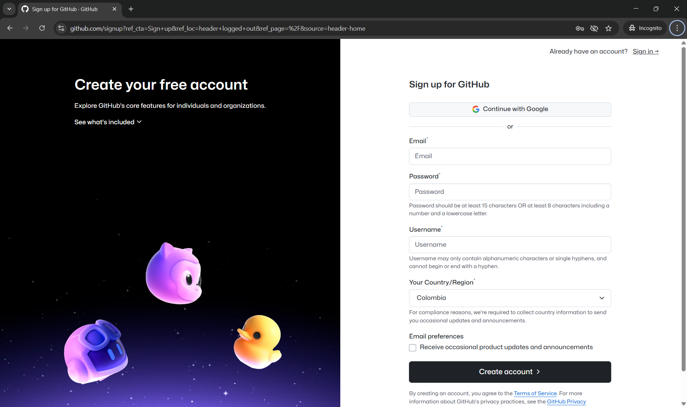
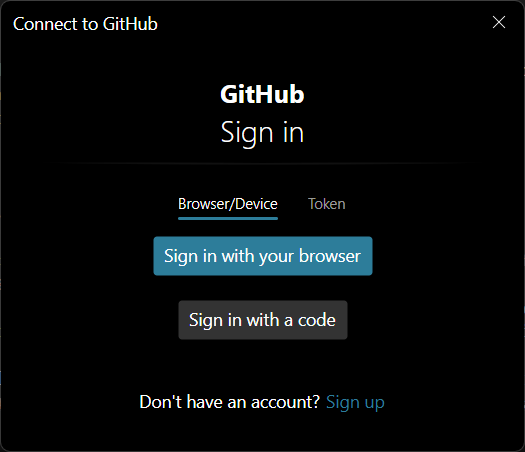
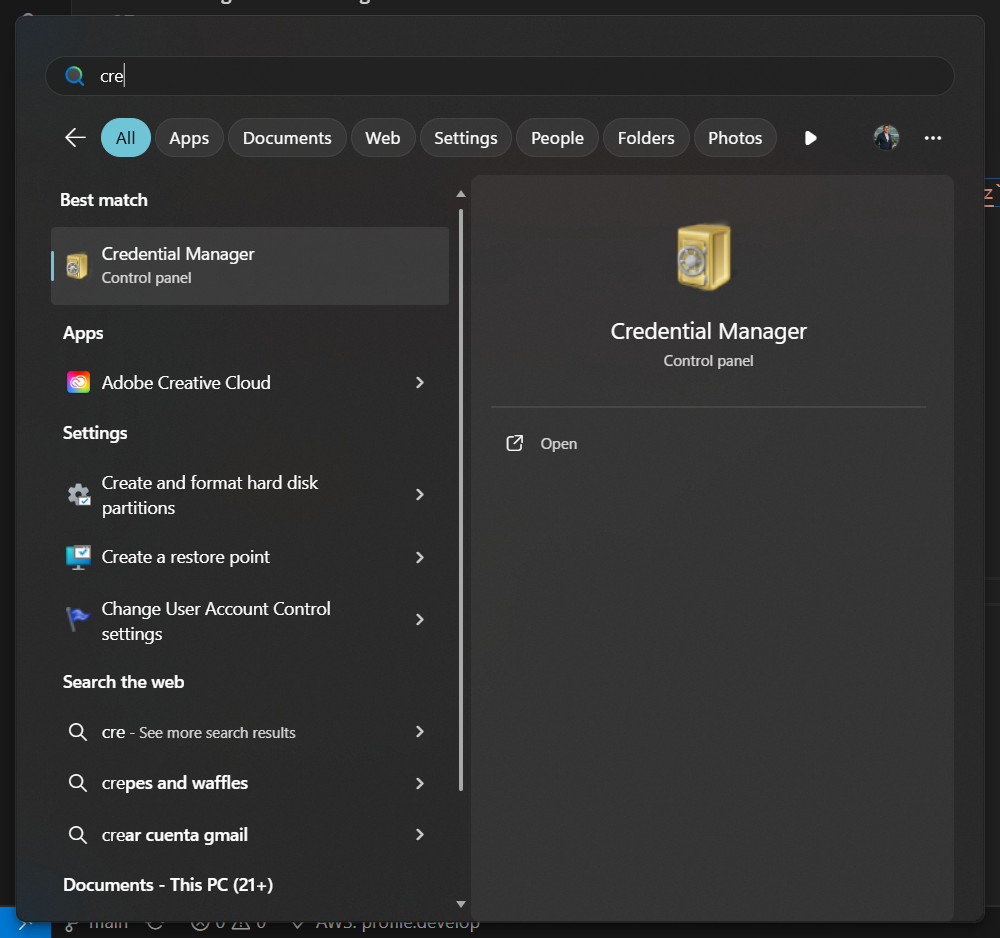
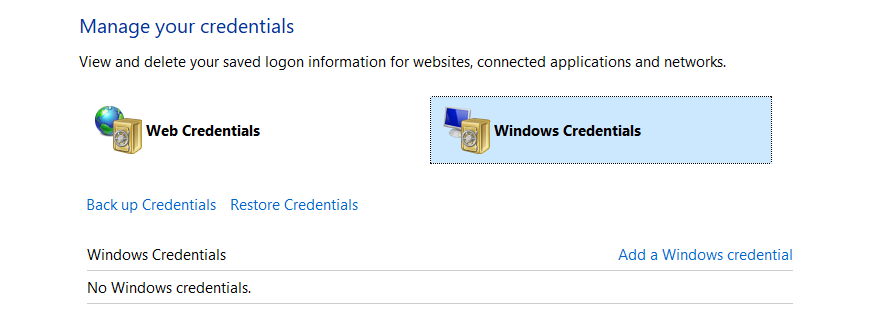
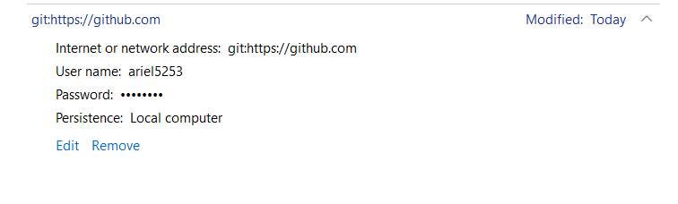

# Manual de Uso de Markdown y Git

## 1. Archivos Markdown (.md)
Los archivos `.md` (Markdown) son documentos de texto plano que emplean una sintaxis sencilla para dar formato al contenido. Son ideales para documentación, notas y presentaciones en proyectos de software por su facilidad de lectura y edición.

### Sintaxis de Markdown
| Etiqueta      | Descripción         | Ejemplo                        |
|--------------|---------------------|--------------------------------|
| #            | Título principal    | # Título                       |
| ##           | Subtítulo           | ## Subtítulo                   |
| ###          | Sub-subtítulo       | ### Sub-subtítulo              |
| **texto**    | Negrita             | **Importante**                 |
| *texto*      | Cursiva             | *Enfatizado*                   |
| -            | Lista               | - Elemento                     |
| 1.           | Lista numerada      | 1. Primer elemento             |
| [texto](url) | Enlace              | [Google](https://google.com)   |
|   | Imagen              |               |
| >            | Cita                | > Esto es una cita             |
| `código`     | Código en línea     | `print('Hola')`                |
| ```          | Bloque de código    | ```python\nprint('Hola')\n``` |

### Ejemplos de Uso
| Sintaxis                | Resultado                                      |
|------------------------ |------------------------------------------------|
| # Título principal      | # Título principal                              |
| ## Subtítulo            | ## Subtítulo                                    |
| **Texto en negrita**    | **Texto en negrita**                            |
| *Texto en cursiva*      | *Texto en cursiva*                              |
| - Elemento de lista     | - Elemento de lista                             |
| 1. Elemento numerado    | 1. Elemento numerado                            |
| [Enlace a Google](...)  | [Enlace a Google](https://google.com)           |
| > Esto es una cita      | > Esto es una cita                              |
| `print('Hola')`         | `print('Hola')`                                 |
| ```python\nprint('Hola mundo')\n``` | 
```python
print('Hola mundo')
```
|

---

## 2. Guía Básica de Git y GitHub

Git es un sistema de control de versiones que permite gestionar los cambios en proyectos de software. GitHub es una plataforma para alojar repositorios Git en la nube.

### Pasos Iniciales

| Paso | Acción | Detalle |
|------|--------|---------|
| 1    | Registro en GitHub | Crear una cuenta en [github.com](https://github.com) |
|      |  | |
| 2    | Configurar Git por primera vez | [Guía oficial](https://git-scm.com/book/es/v2/Inicio---Sobre-el-Control-de-Versiones-Configurando-Git-por-primera-vez) |
|      | Comandos: | |
|      | `git config --global user.name "Tu Nombre"` | |
|      | `git config --global user.email tunombre@email.com` | |
| 3    | Autenticarse en el computador | Si no está autenticado, iniciar sesión |
|      |  | |
| 4    | Verificar datos de acceso | Confirmar usuario y correo configurados |
| 5    | Cerrar sesión | Administrar credenciales de Windows |
|      |  | |
|      |  | |
|      |  | |

### Comandos Básicos de Git
| Acción                        | Comando                                                                 |
|-------------------------------|------------------------------------------------------------------------|
| Clonar repositorio            | `git clone https://github.com/code-corhuila/estructura-datos-2025-b-g1.git` |
| Obtener cambios del repositorio| `git pull`                                                             |
| Publicar cambios locales      | `git add .` <br> `git commit -m "Mensaje en inglés"` <br> `git push`   |

**Recomendación:**
- Escribe los mensajes de commit en inglés y de forma descriptiva.
- Realiza `git pull` antes de publicar cambios para evitar conflictos.

---

Este manual te servirá como referencia rápida para trabajar con archivos Markdown y gestionar tus proyectos con Git y GitHub.
